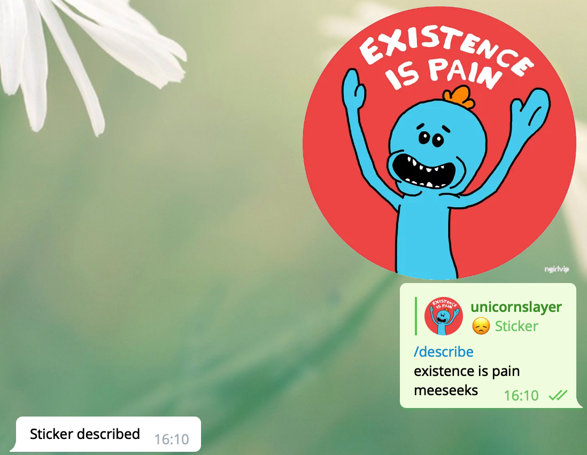
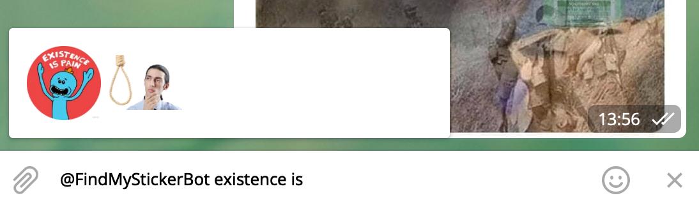

# StickerFinder
Have you ever thought about how much time people spend on searching just the perfect sticker? Have you ever found yourself spending minutes if not hours searching that one sticker that would destroy the person's will to live? Well then, [FindMyStickerBot](https://telegram.me/FindMyStickerBot) is here to help you.

In order to use it, you must first send it a sticker, then reply to it with the command `/describe` and some text, each line containing a separate description.

This bot supports [inline](https://core.telegram.org/bots/inline) queries, meaning you can use this bot to search for stickers from any chat. Simply call it `@FindMyStickerBot <some description>`:

## Run it locally
1. User [BotFather](https://telegram.me/BotFather) to create a bot
2. Take a few extra steps to make it [inline](https://core.telegram.org/bots/inline)
3. Set the token in appsettings.json `TelegramBot:Token`
4. Run it & have fun
